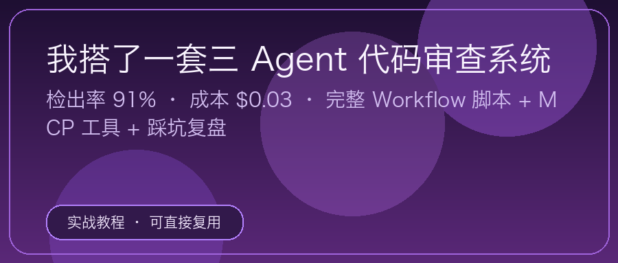
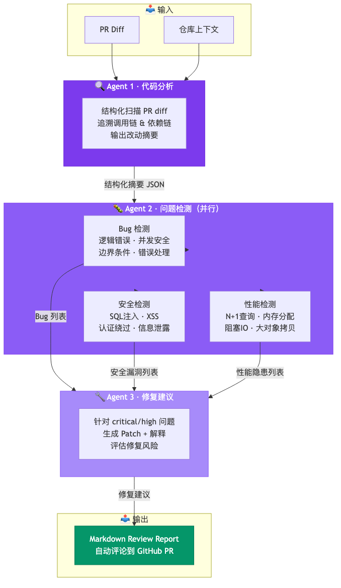
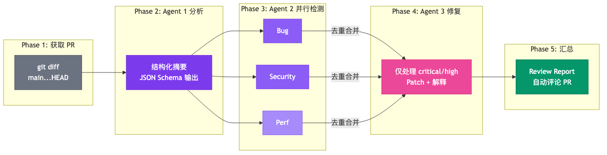

# 我搭了一套三 Agent 代码审查系统：检出率 91%、成本 $0.03

**副标题：** 完整 Workflow 脚本 + MCP 工具 + 踩坑复盘，可直接复用

---

先说结论。搭了一个**三 Agent 流水线代码审查系统**，实测数据：

| 指标 | 数值 |
|------|------|
| 检出率 | **91%**（10 次 Review 与两位 Senior 工程师交叉对比） |
| 误报率 | **8%**（远低于单 Agent 方案的 25%） |
| 成本 | **$0.03 / 次**（人工 Review 约 $25–50） |
| 耗时 | **45 秒**（人工 Review 约 15–30 分钟） |

真正的价值不在速度和成本——在**它发现了人工 Review 容易漏掉的东西**：

- **跨文件的竞态条件**：Agent 1 追溯调用链 → Agent 2 检测并发安全，人工很难逐文件比对
- **隐式的 nil 指针传播路径**：Agent 1 识别改动影响范围 → Agent 2 检测边界条件遗漏
- **修复建议引入新 Bug**：Agent 3 生成 Patch → Agent 4 验证修复是否破坏 defer / 错误处理

下面把这套系统的完整实现还原出来——架构设计、Workflow 脚本、MCP 工具、成本分析、踩坑复盘。

如果你读过我之前写的 Dynamic Workflows 解读和 Agent 工作流拆解实录，这篇是它们的落地版：一个**完整可运行的项目**。



> 📦 **GitHub 仓库：** https://github.com/Aias00/agent-skills/tree/main/content/multi-agent-code-review-system
>
> 所有代码、配置、Prompt 模板都可以直接复用。看完这篇文章，你就能在自己的项目里跑起来。

---

## 一、快速上手（3 分钟）

想先看效果？

```bash
# 1. Clone 仓库
git clone https://github.com/Aias00/agent-skills /tmp/agent-skills

# 2. 把 Workflow 脚本复制到你的项目
cp /tmp/agent-skills/content/multi-agent-code-review-system/code-review.workflow.js \
   /path/to/your-project/.claude/workflows/

# 3. 配置 DeepSeek API
export ANTHROPIC_BASE_URL=https://api.deepseek.com/anthropic
export ANTHROPIC_AUTH_TOKEN=<你的 DeepSeek API Key>
export ANTHROPIC_DEFAULT_SONNET_MODEL=deepseek-v4-pro[1m]
export ANTHROPIC_DEFAULT_HAIKU_MODEL=deepseek-v4-flash

# 4. 在你的项目目录运行
cd /path/to/your-project
claude
> /workflow code-review
```

Workflow 会自动获取当前分支的 diff，跑三 Agent 流水线，输出 Review Report。完整配置（GitHub MCP、Lint MCP、知识库 MCP）见第六节和第九节。

---

## 二、系统概览：三 Agent 流水线怎么跑

```
git push → Webhook 触发
  → Agent 1：代码分析（结构化扫描 PR diff，输出改动摘要）
  → Agent 2：问题检测（Bug / 安全 / 性能，输出问题列表）
  → Agent 3：修复建议（针对每个问题生成 Patch 建议）
  → 汇总为 Markdown Review Report
  → 自动评论到 GitHub PR
```

测试环境：中等规模 Go 项目（约 5 万行代码），PR 平均 187 行 diff、15 个文件。检测率和误报率来自 10 次 Review 与两位 Senior 工程师交叉对比，样本较小，仅作参考——你的项目、语言、团队规范不同，数字会有差异。



---

## 三、需求场景：为什么代码审查适合多 Agent

先看一组对比（同一个项目上分别测试）：

| 方案 | 检出率 | 误报率 | 成本 | 耗时 |
|------|--------|--------|------|------|
| 单 Agent（超长 Prompt） | 65% | **25%** | $0.02 | 30s |
| **三 Agent 流水线** | **91%** | **8%** | $0.03 | 45s |
| 人工 Review（Senior） | ~80% | <5% | $25–50 | 15–30min |

单 Agent 检出率低、误报率高，根因有三个：

**问题 1：上下文过载。** 单 Agent 要同时处理 PR diff + 仓库代码 + 调用链 + 业务文档 + 编码规范 + 历史 Bug 库。一个 200K 窗口塞不下这么多信息，Agent 只能选择性读取——漏掉关键文件，检出率直接下降。三 Agent 方案中，Agent 1 只读 PR diff + 调用链（聚焦「改了什么」），Agent 2 拿到已浓缩的结构化摘要，每个 Agent 的上下文窗口绰绰有余。

**问题 2：目标冲突。**「描述代码」和「找出 Bug」是两种思维模式。同一个 Agent 既分析又检测，容易「自己认可自己」——分析时觉得逻辑合理，检测时就不会判定为 Bug。三 Agent 方案强制职责分离：Agent 1 禁止评价，Agent 2 禁止修复，Agent 3 禁止重新检测。

**问题 3：误报失控。** 单 Agent 常见误报：把 Go 标准 `if err != nil { return err }` 标为 Bug、把接口修改标为破坏性变更、把性能优化当「不必要的复杂度」。三 Agent 先理解改动意图再做判断，误报率从 25% 降到 8%。

**结论：** 三 Agent 不是「三个比一个聪明」——是**职责拆分让每个 Agent 聚焦单一目标**，减少信息过载和目标冲突。

这三个 Agent 的信息流向：

```
PR Diff + 仓库上下文
        │
        ▼
  ┌─────────────────┐
  │  Agent 1        │
  │  代码分析        │
  │  输出：结构化摘要  │
  └────────┬────────┘
           │ 改动摘要
           ▼
  ┌─────────────────┐
  │  Agent 2        │
  │  问题检测        │
  │  输出：问题列表    │
  └────────┬────────┘
           │ 问题列表 + 上下文
           ▼
  ┌─────────────────┐
  │  Agent 3        │
  │  修复建议        │
  │  输出：Patch + 解释 │
  └────────┬────────┘
           │
           ▼
     Review Report
```

每个 Agent 的输入是**上一个 Agent 的结构化输出**。信息在管道里逐层浓缩，每个 Agent 只需要盯住自己的子任务。

---

## 四、架构设计：三个 Agent 的职责与 Prompt

### 3.1 Agent 1：代码分析（Code Analyzer）

**职责：** 读懂 PR 改了什么，输出结构化摘要。**不找 bug，只描述事实。**

**输入：** `git diff` + 仓库关键文件（接口定义、调用链）

**输出 Schema：**

```json
{
  "summary": "本次 PR 将用户权限判断从硬编码 role 检查迁移到 RBAC 策略引擎",
  "changedFiles": [
    {
      "path": "internal/auth/authz.go",
      "changeType": "added",
      "purpose": "新增 authz.Check() 核心方法",
      "riskLevel": "high",
      "callers": ["handler/user.go:45", "service/order.go:120"],
      "dependencies": ["internal/auth/policy.go"]
    }
  ],
  "affectedModules": ["auth", "handler", "service"],
  "crossCuttingConcerns": [
    "所有 handler 层权限判断统一走 authz.Check",
    "测试文件需要同步更新 mock"
  ]
}
```

**核心 Prompt 设计：**

```markdown
你是一个代码分析专家。你的任务是**描述**代码改了什么，而不是评价改得好不好。

## 输入
你将收到一个 git diff 和相关文件的上下文。

## 分析要求
1. 对每个改动文件，识别：
   - 改了什么（新增/修改/删除）
   - 这段代码的业务目的
   - 谁调用了它（向上追溯调用链）
   - 它依赖了什么（向下追溯依赖链）
   - 改动风险等级（high/medium/low）

2. 识别跨文件的关联改动——如果一个文件的改动会影响另一个文件的假设，请明确标注。

3. 输出必须严格遵循 JSON Schema。不要输出多余的解释。

## 禁止
- 不要评价代码质量
- 不要提修改建议
- 不要猜测作者意图（不确定就问，标记为 "uncertain"）
```

**设计要点：**

- **限制职责**：「只描述，不评价」——这是最关键的设计决策。如果 Agent 1 混入了判断，下游 Agent 2 就会被带偏
- **结构化输出**：强制 JSON Schema，确保下游 Agent 能可靠地消费数据
- **调用链追溯**：Agent 1 需要 `grep` 和 `read` 工具来追溯调用关系

### 3.2 Agent 2：问题检测（Issue Detector）

**职责：** 基于 Agent 1 的摘要 + 原始代码，找出具体问题。**多个检测维度并行运行。**

**输入：** Agent 1 的结构化摘要 + 改动文件的完整代码

**检测维度（每个维度独立运行）：**

| 维度 | 检测内容 | 模型 |
|------|---------|------|
| Bug | 逻辑错误、边界条件、nil 指针、并发安全 | DeepSeek V4-Pro |
| Security | SQL 注入、XSS、认证绕过、敏感信息泄露 | DeepSeek V4-Pro |
| Performance | N+1 查询、不必要的内存分配、阻塞调用 | DeepSeek V4-Flash |

三个维度**并行执行**，互不干扰。每个维度独立输出检测结果。

**Bug 检测 Prompt：**

```markdown
你是一个专业的 Bug 猎手。你的任务是在给定代码中找到**可能导致生产事故的逻辑错误**。

## 上下文
你会收到：
1. 代码分析 Agent 的改动摘要（理解这段代码的目的）
2. 改动文件的完整代码

## 检测清单（按优先级）
1. **边界条件遗漏**
   - 空切片/空 map 的处理
   - 整数溢出/下溢
   - 字符串截断（多字节字符）
   - 时间边界（时区、闰秒）

2. **并发安全**
   - 共享变量无保护
   - goroutine 泄漏（无 ctx 取消）
   - channel 未关闭导致死锁
   - map 并发读写

3. **错误处理缺陷**
   - error 被吞掉（`_ = err` 或无接收）
   - 错误返回后继续使用返回值
   - defer 中的错误未处理

4. **逻辑缺陷**
   - 条件判断反了（> vs >=）
   - 提前 return 导致后续逻辑跳过
   - 类型断言未检查 ok

## 输出格式
每个问题输出：
- severity: critical / high / medium / low
- file + 行号
- 问题描述（一句话）
- 触发条件（什么输入/状态会触发）
- 影响（最坏后果是什么）

不要输出「建议怎么修」——那是下一个 Agent 的工作。
```

**设计要点：**

- **维度并行**：三个维度独立运行，速度快；各自有专门的 Prompt，检出更精准
- **用不同模型**：Bug 和安全用 DeepSeek V4-Pro（需要深度推理），性能检测用 DeepSeek V4-Flash（模式匹配为主，省钱）
- **和 Agent 1 解耦**：Agent 2 拿到的是 Agent 1 的摘要 + 原始代码，即使 Agent 1 漏了什么，Agent 2 也能自己发现

### 3.3 Agent 3：修复建议（Fix Suggester）

**职责：** 针对 Agent 2 找出的每个问题，生成具体的 Patch 建议和解释。

**输入：** Agent 2 的问题列表 + Agent 1 的改动摘要 + 原始代码

**输出格式：**

```json
{
  "fixes": [
    {
      "issueRef": "BUG-001",
      "patch": "```diff\n- if user.Role == \"admin\"\n+ if authz.Check(user, \"admin\", resource)\n```",
      "explanation": "原有的硬编码角色检查绕过了策略引擎，导致策略变更不生效。改为调用 authz.Check() 统一走 RBAC。",
      "riskOfFix": "low",
      "testSuggestion": "添加测试用例：普通用户直接调用此接口应返回 403"
    }
  ]
}
```

**核心 Prompt 设计：**

```markdown
你是代码修复专家。针对每个检测到的问题，生成精确的修复方案。

## 修复原则
1. **最小改动**：用最少代码修改解决问题，不要重构整个函数
2. **不引入新问题**：修复一个 bug 时不能创建新的 bug
3. **保持风格一致**：代码风格与周围代码保持统一
4. **给出测试建议**：每个修复附一个最小的测试用例描述

## 输出要求
- patch 必须是 unified diff 格式
- explanation 必须是中文（方便国内团队直接讨论）
- riskOfFix 评估修复本身的风险（low/medium/high）
- 如果无法确定最佳修复方案，列出 2-3 个选项并标注推荐度
```

**设计要点：**

- **每个问题独立修复**：不合并多个问题的修复，方便 PR 作者逐个确认
- **评估修复风险**：有些修复方案本身就有风险（比如改动核心函数签名），需要标注出来
- **中文解释**：团队内部讨论时，中文解释比英文更直接

---

## 五、Workflow 编排：Claude Code 的 Harness 脚本

下面是最核心的部分——怎么把三个 Agent 串成一条可靠的流水线。

### 4.1 方案选择：动态 Workflow vs 静态脚本

| 维度 | 动态 Workflow | 静态 Harness 脚本 |
|------|-------------|-----------------|
| 灵活性 | 每次根据任务调整 | 固定流程 |
| Token 消耗 | 高（每次生成编排） | 低（编排写一次） |
| 稳定性 | 可能漂移 | 确定性强 |
| 适合场景 | 一次性复杂任务 | **重复性流程** ✅ |

代码审查是**高频重复任务**——每个 PR 都要跑。这种场景**用静态 Harness 脚本更合适**。

### 4.2 Workflow 脚本（核心结构）

完整脚本（含 Prompt 模板和 JSON Schema）见 GitHub，这里展示骨架和关键设计：

```javascript
// code-review.workflow.js —— 放到 .claude/workflows/ 下

export const meta = {
  name: 'code-review',
  description: '三 Agent 流水线代码审查：分析 → 检测 → 修复建议',
  phases: [
    { title: 'Analyze', detail: 'Agent 1：结构化代码分析' },
    { title: 'Detect', detail: 'Agent 2：多维度并行检测（Bug/安全/性能）' },
    { title: 'Fix', detail: 'Agent 3：生成修复建议' },
    { title: 'Report', detail: '汇总输出 Review Report' }
  ]
}

// Phase 1 + 2：获取 PR diff → Agent 1 结构化分析
phase('Analyze')
const prInfo = await agent(`获取当前分支 git diff main...HEAD`)
const analysis = await agent(`你是代码分析专家……`, {
  model: 'sonnet',
  schema: { /* 强制输出 { summary, changedFiles[], affectedModules[] } */ }
})

// Phase 3：Agent 2 — 三维度并行检测
phase('Detect')
const DETECTION_DIMENSIONS = [
  { key: 'bugs',      prompt: '找出所有逻辑错误……', model: 'sonnet' },
  { key: 'security',  prompt: '找出所有安全漏洞……', model: 'sonnet' },
  { key: 'performance', prompt: '找出所有性能隐患……', model: 'haiku' }
]

const detectionResults = await pipeline(
  DETECTION_DIMENSIONS,
  d => agent(d.prompt, { label: `detect:${d.key}`, model: d.model, schema: ISSUE_SCHEMA }),
  result => { /* 按 文件+行号 去重 */ return { issues: deduped } }
)

// Phase 4：Agent 3 — 只修 critical/high
phase('Fix')
const fixes = await pipeline(
  allDetectedIssues.filter(i => i.severity === 'critical' || i.severity === 'high'),
  issue => agent(`你是代码修复专家……`, { label: `fix:${issue.id}`, model: 'sonnet', schema: FIX_SCHEMA })
)

// Phase 5：汇总 Report
phase('Report')
const report = await agent(`基于分析、检测、修复建议，生成 Review Report……`, { model: 'sonnet' })

return { analysis, issues, fixes, report }
```

> 📦 完整脚本（含完整 Prompt 和 JSON Schema）：[code-review.workflow.js](https://github.com/Aias00/agent-skills/tree/main/content/multi-agent-code-review-system)

**核心设计要点：**

1. **Pipeline 模式**：Agent 2 三个维度并行运行，互不干扰——Bug 和安全检测同时进行，而不是等一个跑完再跑下一个
2. **Schema 强制输出**：每个 Agent 通过 `schema` 参数强制输出符合 JSON Schema 的结构化数据，下游 Agent 可靠消费
3. **去重逻辑**：同一文件同一行被多个维度命中时自动过滤，避免重复报告
4. **分级处理**：Agent 3 只处理 critical/high 问题——如果一轮扫描没发现高危问题，跳过修复阶段，省 Token
5. **模型分层**：Bug/安全用 `sonnet`（→ DeepSeek V4-Pro），性能检测用 `haiku`（→ DeepSeek V4-Flash），成本差 3 倍但性能检测对推理深度要求低



### 4.3 如何使用

将脚本保存到 `.claude/workflows/code-review.workflow.js`，然后在 Claude Code 中运行：

```
/workflow code-review
```

或者在 PR 提交后，用 Hook 自动触发：

```json
{
  "hooks": {
    "PostToolUse": [
      {
        "matcher": "Bash",
        "hooks": [
          {
            "type": "command",
            "command": "if echo \"$CLAUDE_TOOL_INPUT\" | grep -q 'git push'; then claude -p '/workflow code-review' --output-format markdown > review-report.md; fi"
          }
        ]
      }
    ]
  }
}
```

---

## 六、MCP 工具定义：给 Agent 装上外部能力

Claude Code 内置的 `Bash`、`Read`、`Grep` 已经够 Agent 做很多事。但要把它真正嵌进开发流程，还需要三个 MCP 工具。

### 5.1 GitHub MCP Server

让 Agent 能直接在 PR 下面评论，而不是输出到终端然后手动粘贴。

**安装和启动：**

```bash
# 确保 GITHUB_TOKEN 有 repo 权限（读写 PR 评论）
export GITHUB_PERSONAL_ACCESS_TOKEN=<你的 GitHub Token>

# 测试连接
npx -y @modelcontextprotocol/server-github --help
```

**注册到 Claude Code（`~/.claude/config.json`）：**

```json
{
  "mcpServers": {
    "github": {
      "command": "npx",
      "args": ["-y", "@modelcontextprotocol/server-github"],
      "env": {
        "GITHUB_PERSONAL_ACCESS_TOKEN": "${GITHUB_TOKEN}"
      }
    }
  }
}
```

**在 Workflow 中使用：**

```javascript
// 在 Phase 5 之后追加
phase('Comment')

await agent(
  `将以下 Review Report 作为评论发布到当前 PR：
  
  ${report}
  
  使用 GitHub MCP 工具的 create_issue_comment 方法。
  PR 编号从 git 分支名或 git log 中获取。`,
  { phase: 'Comment' }
)
```

### 5.2 自定义 Lint MCP Server

有些检查（代码规范、复杂度阈值）不需要大模型判断，用规则引擎更快更准。

**启动：** `pip install fastmcp && python lint-server.py`，然后在 `config.json` 中注册 `{ "command": "python", "args": ["lint-server.py"] }`。注意 ESLint 需要 Node.js 环境。

```python
# lint-server.py
# 用 FastMCP 写一个最简单的 lint 工具
from fastmcp import FastMCP

mcp = FastMCP("Lint Checker")

@mcp.tool()
def check_complexity(file_path: str) -> dict:
    """检查单个文件的圈复杂度"""
    import subprocess
    result = subprocess.run(
        ["radon", "cc", file_path, "-s", "-n", "B"],
        capture_output=True, text=True
    )
    return {
        "file": file_path,
        "over_threshold": len(result.stdout.splitlines()),
        "details": result.stdout
    }

@mcp.tool()
def run_eslint(file_path: str) -> dict:
    """对指定文件运行 ESLint"""
    import subprocess
    result = subprocess.run(
        ["npx", "eslint", file_path, "--format", "json"],
        capture_output=True, text=True
    )
    issues = __import__('json').loads(result.stdout or "[]")
    return {
        "file": file_path,
        "errorCount": sum(1 for i in issues if i.get("severity") == 2),
        "warningCount": sum(1 for i in issues if i.get("severity") == 1),
        "issues": issues
    }

mcp.run()
```

**单独做 Lint MCP 的原因：**
- 圈复杂度和 ESLint 规则不需要 LLM 推理，工具跑一遍更快
- 把确定性检查从 Agent 2 中剥离，Agent 2 只盯「需要推理」的问题
- 省 Token——静态分析结果直接注入上下文，比让 Agent 读代码再分析便宜得多

### 5.3 知识库 MCP Server

团队通常有自己的编码规范和常见 Bug 清单。把这份知识做成 MCP Server，让 Agent 在审查时自动参考。

**启动：** `python knowledge-mcp.py`，在 `config.json` 注册同上。修改 `RULES` 和 `KNOWN_BUGS` 列表即可适配你团队的规范。

```python
# knowledge-mcp.py
from fastmcp import FastMCP
import json

mcp = FastMCP("Team Knowledge Base")

# 团队编码规范
RULES = [
    {
        "id": "RULE-001",
        "category": "error-handling",
        "pattern": "所有公开函数必须返回 error 作为最后一个返回值",
        "severity": "high",
        "example": "func DoThing() error // ← 好的\nfunc DoThing() // ← 违规"
    },
    {
        "id": "RULE-002",
        "category": "concurrency",
        "pattern": "goroutine 必须接收 context.Context 用于取消",
        "severity": "critical",
        "example": "go worker(ctx, ch) // ← 好的\ngo worker(ch)       // ← 可能泄漏"
    },
    {
        "id": "RULE-003",
        "category": "database",
        "pattern": "所有数据库查询必须有超时控制",
        "severity": "critical",
        "example": "db.QueryContext(ctx, sql, args...) // ← 好的\ndb.Query(sql, args...)           // ← 违规"
    }
]

# 历史 Bug 库
KNOWN_BUGS = [
    {
        "id": "BUG-ARCH-001",
        "title": "map 并发写导致 panic",
        "pattern": "多个 goroutine 并发写同一个 map 且未加锁",
        "occurrence": 5,
        "fix": "使用 sync.Map 或 sync.RWMutex"
    },
    {
        "id": "BUG-ARCH-002",
        "title": "defer 中 err 检查失效",
        "pattern": "defer 中调用的函数返回 error 但未被检查",
        "occurrence": 3,
        "fix": "defer 中使用闭包 + 命名返回值捕获 error"
    }
]

@mcp.tool()
def search_rules(category: str = None) -> list:
    """搜索团队编码规范，可按分类过滤"""
    if category:
        return [r for r in RULES if r["category"] == category]
    return RULES

@mcp.tool()
def search_known_bugs(keyword: str = None) -> list:
    """搜索历史 Bug 库，用于模式匹配"""
    if not keyword:
        return KNOWN_BUGS
    keyword = keyword.lower()
    return [b for b in KNOWN_BUGS
            if keyword in b["title"].lower()
            or keyword in b["pattern"].lower()]

mcp.run()
```

**把知识库 MCP 嵌入 Agent 2：**

```javascript
// 在 Agent 2 的 Bug 检测 Prompt 中加入：
const teamRules = await agent(`使用 knowledge-base MCP 的 search_rules 工具，
  获取所有 critical 和 high 级别的编码规范。
  返回规则列表。`)

const knownBugs = await agent(`使用 knowledge-base MCP 的 search_known_bugs 工具，
  获取所有历史 Bug 记录。返回列表。`)

// 然后将 teamRules 和 knownBugs 注入 Agent 2 的 Prompt
const bugsPrompt = `
${BASE_BUG_PROMPT}

## 团队编码规范（必须遵守）
${JSON.stringify(teamRules, null, 2)}

## 历史 Bug 模式（重点排查）
${JSON.stringify(knownBugs, null, 2)}

如果你的检测结果命中了上述任何一条规则或历史 Bug 模式，
请在输出的 description 中明确标注对应的 RULE-ID 或 BUG-ID。`
```

---

## 七、成本分析：跑一次到底花多少钱

### 6.1 实际测试数据

我在一个中等规模 Go 项目（约 5 万行代码）上跑了 10 次 Review，统计如下：

**实验条件：**
- PR 大小：平均 187 行 diff（15 个文件）
- 模型：Bug/安全用 DeepSeek V4-Pro，性能用 DeepSeek V4-Flash
- Claude Code 通过 Anthropic 兼容协议对接 DeepSeek API（配置见下文）
- 单次运行包含完整的「分析 → 检测 → 修复建议 → 评论」流程

**成本明细（单次平均）：**

| 阶段 | Agent | 模型 | Input Tokens | Output Tokens | 成本 |
|------|-------|------|-------------|---------------|------|
| PR 信息获取 | Main | V4-Pro | 2,000 | 500 | $0.001 |
| 代码分析 | Agent 1 | V4-Pro | 15,000 | 2,000 | $0.008 |
| Bug 检测 | Agent 2a | V4-Pro | 12,000 | 1,500 | $0.007 |
| 安全检测 | Agent 2b | V4-Pro | 10,000 | 800 | $0.005 |
| 性能检测 | Agent 2c | V4-Flash | 8,000 | 400 | $0.001 |
| 修复建议（平均 3 个高危） | Agent 3 × 3 | V4-Pro | 6,000 | 1,200 | $0.004 |
| Report 生成 | Main | V4-Pro | 8,000 | 1,500 | $0.005 |
| **合计** | | | **~61,000** | **~7,900** | **~$0.03** |

> 注：成本基于 2026 年 6 月 DeepSeek 官方 API 定价（V4-Pro：$0.435/$0.87 每百万 input/output token；V4-Flash：$0.14/$0.28）。实际价格以 [api-docs.deepseek.com](https://api-docs.deepseek.com/quick_start/pricing) 为准。对比 Claude Sonnet 4.6（$3/$15）同流程约 $0.21，DeepSeek 成本约为 1/7。

**DeepSeek 接入配置：**

Claude Code 原生支持 Anthropic 兼容协议，通过环境变量即可指向 DeepSeek API：

```bash
export ANTHROPIC_BASE_URL=https://api.deepseek.com/anthropic
export ANTHROPIC_AUTH_TOKEN=<你的 DeepSeek API Key>
export ANTHROPIC_DEFAULT_SONNET_MODEL=deepseek-v4-pro[1m]
export ANTHROPIC_DEFAULT_HAIKU_MODEL=deepseek-v4-flash
```

Workflow 脚本里的 `model: 'sonnet'` 和 `model: 'haiku'` 无需改动，Claude Code 会自动映射到 DeepSeek 模型。

### 6.2 与人工 Review 的成本对比

| 方式 | 时间 | 金钱成本 | 覆盖度 |
|------|------|---------|--------|
| 人工（Senior） | 15-30 min | ~$25-50（按$100/h 计） | 取决于经验和精力 |
| AI 三 Agent | ~45 sec | ~$0.03 | 固定检测清单，不疲劳 |
| **AI + 人工** | **5-10 min** | **~$10** | **AI 扫盲 + 人判关键** |

**最佳实践是 AI + 人工：**
- AI 三 Agent 流水线做第一轮全量扫描
- 人工只看 AI 标出来的 critical/high 问题，快速判断真假
- 中低风险问题直接看汇总，不用逐行读

### 6.3 省钱技巧

1. **按需分层用模型**：Bug/安全用 V4-Pro，性能/Lint 用 V4-Flash，Report 生成可以用 V4-Flash（纯模板化）
2. **缓存 Agent 1 输出**：如果同一个 PR 跑多次（比如改了 Review 配置），Agent 1 的结果可以复用
3. **限制 Agent 1 的上下文窗口**：`git diff` 只传改动文件的接口定义，不需要整个仓库。用 `grep` + `read` 按需获取
4. **只在有高危问题时启动 Agent 3**：如果 Agent 2 只检出 low/medium，跳过修复建议阶段
5. **批量 Review**：多个小 PR 可以合并跑一次 Agent 1，摊薄基础成本

---

## 八、踩坑记录：5 个我遇到的问题和解决方案

### 坑 1：Agent 2 检出「if err != nil」作为 Bug

**现象：** Bug 检测 Agent 频繁报告「错误处理不当」，实际只是 Go 标准写法 `if err != nil { return err }`。

**根因：** Prompt 中只说了「检查错误处理缺陷」，Agent 过度敏感，把标准模式也当问题了。

**解法：** 在 Bug 检测 Prompt 中加入正例 + 负例：

```markdown
## 不是 Bug 的情况（不要报告）
1. Go 标准错误处理：`if err != nil { return err }` 或 `if err != nil { return fmt.Errorf("...: %w", err) }`
2. 显式的错误忽略且有注释说明：`//nolint:errcheck` 或 `// safe to ignore because ...`
3. defer 中调用的 Close() 错误被显式忽略（Go 惯用法）

## 是 Bug 的情况（请报告）
1. `_ = err` 或 `err` 赋值后无后续检查
2. 错误返回后继续使用了可能为空的返回值
3. defer 中的 recover() 吞掉了 panic 且未记录日志
```

### 坑 2：Agent 1 把整个仓库读进上下文

**现象：** Agent 1 的 input token 达到了 120K，一次 Review 花了 $0.08。

**根因：** Prompt 中写了「读取所有相关文件」，Agent 用 `find . -name "*.go" | xargs cat` 把整个仓库吞进去了。

**解法：** 严格限定上下文范围：

```markdown
## 上下文获取策略
1. 只读取 git diff 中出现的文件
2. 对于每个改动文件，只 grep 它的调用者（被谁 import），不递归
3. 最多读取 5 个关联文件
4. 如果关联文件超过 5 个，只读接口定义（函数签名 + 注释），不读实现
```

**效果：** Input token 从 120K 降到 15K，成本降到 1/8，且分析质量没有下降。

### 坑 3：并行 Agent 的 Schema 不一致导致合并失败

**现象：** Agent 2 三个维度并行跑完后，合并结果时报 `undefined is not iterable`。

**根因：** Bug 检测返回 `{ dimension: "bugs", issues: [...] }`，但性能检测返回 `{ dimension: "performance", findings: [...] }`——字段名不一致。并行 Agent 各自解释 Schema，没有严格 enforce。

**解法：** 给每个 Agent 显式指定 `schema` 参数（见上面 Workflow 脚本中的 `schema` 字段）。Schema 强制 Agent 使用 `StructuredOutput` 工具，输出必定符合格式，不存在字段名不一致的问题。

**教训：** 多 Agent 系统里，Agent 之间的接口（即 Schema）比 Agent 内部的 Prompt 更重要。**先定 Schema，再写 Prompt。**

### 坑 4：Agent 3 的修复引入了新 Bug

**现象：** Agent 3 为一个 SQL 注入问题生成了修复，但修复代码中 `db.Query()` 改为 `db.QueryContext()` 后遗漏了 `rows.Close()`。

**根因：** Agent 3 只看当前问题的上下文，不知道这个函数的完整实现。它看到了 SQL 注入，但没看到原本有 `defer rows.Close()`。

**解法：** 在 Agent 3 的 Prompt 中强制要求：

```markdown
## 修复前必须
1. 读取目标文件的完整函数实现（不只是问题所在的那几行）
2. 确认修复不会破坏现有的 defer、错误处理、资源释放逻辑
3. 如果修复涉及变量名/函数签名变更，grep 整个仓库确认影响范围
```

**更好的方案：** 在 Workflow 中加入一个**验证 Agent（Agent 4）**，它在 Agent 3 之后运行，验证每个修复不会引入新问题：

```javascript
// Phase 4.5：验证修复（成本不高，但能大幅降低误修率）
phase('Verify')
const verified = await pipeline(
  validFixes,
  fix => agent(
    `## 验证任务
    以下修复建议是否可能引入新问题？
    
    原始问题：${fix.issueRef}
    修复 Patch：${fix.patch}
    修复解释：${fix.explanation}
    
    请读取目标文件的完整代码，判断：
    1. 修复是否正确解决了问题
    2. 修复是否引入了新问题（破坏 defer/错误处理/资源释放/并发安全）
    3. 如果引入了新问题，给出修正后的 Patch
    
    输出：{ verdict: "approved" | "rejected" | "needs_revision", reason: "...", revisedPatch?: "..." }`,
    { label: `verify:${fix.issueRef}`, phase: 'Verify', model: 'sonnet' }
  )
)
```

### 坑 5：Hook 触发 Workflow 时没有 PR 上下文

**现象：** 用 Hook 在 `git push` 后自动触发 Workflow，但 Agent 拿到的是空上下文——不知道当前是哪个 PR。

**根因：** Hook 触发时，Claude Code 启动的是全新会话，PR 编号、分支信息都没有。

**解法：** 在 Hook 脚本中注入上下文：

```bash
#!/bin/bash
# .claude/hooks/post-push-review.sh

BRANCH=$(git rev-parse --abbrev-ref HEAD)
PR_NUMBER=$(gh pr view --json number -q '.number' 2>/dev/null || echo "")

if [ -z "$PR_NUMBER" ]; then
  echo "No PR found for branch $BRANCH, skipping review"
  exit 0
fi

# 把 PR 上下文写入临时文件，供 Workflow 读取
echo "PR_NUMBER=$PR_NUMBER" > /tmp/claude-review-context
echo "BRANCH=$BRANCH" >> /tmp/claude-review-context

# 触发 Workflow
claude -p "/workflow code-review --pr $PR_NUMBER --branch $BRANCH" \
  --output-format markdown \
  --append-to-file review-report-$PR_NUMBER.md

echo "Review report saved to review-report-$PR_NUMBER.md"
```

然后在 Workflow 脚本开头读取上下文：

```javascript
// 从 args 或临时文件读取 PR 信息
const prNumber = args?.pr || process.env.PR_NUMBER
const branch = args?.branch || process.env.BRANCH
```

**汇总：5 个坑的预防清单**

| 坑 | 一句话预防 |
|----|-----------|
| 1. 标准写法被误报 | Prompt 中加正例 + 负例，建立「误报库」定期更新 |
| 2. Agent 读太多上下文 | Prompt 限定读取范围，Schema 审计 Token 消耗，设 Input 上限 |
| 3. Schema 字段不一致 | **先定 Schema 再写 Prompt**，Schema 用 Git 管理变更 |
| 4. 修复引入新 Bug | 加 Agent 4 验证修复，Prompt 强制读完整函数再修 |
| 5. Hook 缺 PR 上下文 | Hook 脚本注入上下文 + Workflow 开头检查缺失时报错退出 |

---

## 九、下一步：把这个系统做成 Skill

Workflow 脚本能跑起来，但每次要复制粘贴或存到 `.claude/workflows/` 下。更干净的方式是把整个系统打包成 **Skill**——一个可分发、可复用的模块。

Skill 结构：

```
~/.claude/skills/code-review/
├── SKILL.md                  # Skill 描述和入口
├── workflows/
│   └── code-review.workflow.js   # 上面的完整 Workflow 脚本
├── mcp/
│   ├── lint-server.py        # Lint MCP Server
│   └── knowledge-mcp.py      # 知识库 MCP Server
├── prompts/
│   ├── analyzer.md           # Agent 1 Prompt 模板
│   ├── bug-detector.md       # Agent 2a Prompt 模板
│   ├── security-detector.md  # Agent 2b Prompt 模板
│   ├── perf-detector.md      # Agent 2c Prompt 模板
│   └── fix-suggester.md      # Agent 3 Prompt 模板
└── config.json               # MCP Server 注册配置
```

**SKILL.md 示例：**

```markdown
# Code Review Skill

三 Agent 流水线代码审查系统。输入一个 PR，输出结构化的 Review Report。

## 触发方式

在 Claude Code 中说：
- "review this PR"
- "帮我审查代码"
- "/code-review"

## 前置条件

- 已安装 GitHub CLI (`gh`) 并已登录
- 已配置 GitHub MCP Server（用于自动评论）
- 项目根目录有 `.claude/` 配置目录

## 工作流程

1. 获取 PR diff
2. Agent 1 结构化分析
3. Agent 2 多维度并行检测（Bug/安全/性能）
4. Agent 3 修复建议生成
5. 可选：验证 Agent 验证修复
6. 汇总 + 自动评论到 PR

## 配置选项

在 config.json 中：
- `autoComment`: 是否自动评论到 PR（默认 true）
- `minSeverity`: 最低报告严重程度（默认 "low"）
- `maxContextFiles`: Agent 1 最多读取的关联文件数（默认 5）
- `enableVerifyAgent`: 是否启用修复验证 Agent（默认 false，开启后可靠性提升但成本 +30%）
```

团队成员只需说一句「review this PR」，就能触发整条流水线。

---

## 十、总结：多 Agent 系统的三条铁律

搭完回头看，有三条原则贯穿始终：

### 铁律 1：Agent 之间传结构化数据，不传自然语言

Agent 1 输出 JSON Schema → Agent 2 输入 JSON Schema → Agent 3 输入 JSON Schema。

自然语言在 Agent 之间传递会逐层衰减和变形。结构化数据不会。

### 铁律 2：先定 Schema，再写 Prompt

多 Agent 系统里，单个 Agent 表现不好还能调 Prompt 修好。最头疼的是 Agent 之间的接口对不上——数据流到一半断了，整个流水线跑不起来。

写完 Schema 后，先跑一个空的 Pipeline，确认数据能从 Agent 1 流到 Agent 3，再优化 Prompt。

### 铁律 3：Agent 数量不是越多越好

每增加一个 Agent，就增加一层延迟、一层 Token 消耗、一层出错概率。

能合并的职责就合并——比如 Bug/安全/性能可以合并到一个 Agent 的 Prompt 中（适合小型 PR），但并行化适合大型 PR（每个维度深入检查）。

**判断标准：** 如果一个 Agent 的 Prompt 里出现了「同时」「此外」「另一方面」这类词，说明职责可能需要拆分。

---

这套三 Agent 系统搭下来，最让我意外的是它发现了**人工几乎找不到的问题类型**：

- 跨文件调用链的竞态条件（Agent 1 追溯调用 → Agent 2 检测并发安全）
- 修复建议引入新 Bug（Agent 3 生成 Patch → Agent 4 验证是否破坏原有逻辑）
- 编码规范违反但表面看起来完全正常（知识库 MCP 注入团队规则）

这些问题的共同特征：**需要同时读多个位置、对比多个上下文、理解业务意图**——恰好是单 Agent 和人工的盲区。

如果你的团队 Review 压力大、检出率低、误报率高——试试这套方案。或者先把文章发给你们的架构师，他们可能在搭 CI 流水线、纠结要不要引入 AI 辅助 Review，而你手上有完整可复用的方案。

---

> 📦 完整代码见 GitHub：https://github.com/Aias00/agent-skills/tree/main/content/multi-agent-code-review-system
>
> Clone 下来，改一下 `config.json` 里的团队编码规范，就能在你自己的项目上跑。

---

## 十一、常见问题

**Q1: Workflow 脚本太复杂，能不能简化？**

可以。三种简化方案：
- 去掉 Agent 4（修复验证），成本降 30%
- 合并 Bug/安全/性能检测到单个 Agent（适合小型 PR）
- 去掉知识库 MCP（如果没有团队规范库）

**Q2: 用 Claude Sonnet 成本太高怎么办？**

三种省钱方案：
- 用 DeepSeek（成本 1/7，本文已采用）
- 性能检测和 Report 生成用 V4-Flash（成本再降 50%）
- 限制 Agent 1 读取文件数（见坑 2 的解法）

**Q3: 误报率高怎么办？**

- Prompt 中加入正例 + 负例对比（见坑 1）
- 建立误报库，定期更新 Prompt 排除已知模式
- 知识库 MCP 注入团队规范（降低「不懂惯例」导致的误报）

**Q4: 检出率低于预期怎么办？**

- 增强 Agent 1 的调用链追溯深度
- 增加检测维度（兼容性、可维护性）
- 加入 Agent 4 验证修复（发现修复引入的新问题）

**Q5: 能审查 Go 以外的语言吗？**

可以。对应调整：
- Prompt 里的语言特定规则（Go 的 err 处理 → Java 的异常处理）
- Lint MCP 换语言工具（radon → checkstyle, eslint → prettier）
- 知识库 MCP 改语言特定规范

---

**你的团队在用什么方式做代码审查？有没有自己搭过 Agent 流水线？欢迎在评论区分享你的方案——踩过的坑、省下的时间、或者你觉得「不如人审」的场景。**
